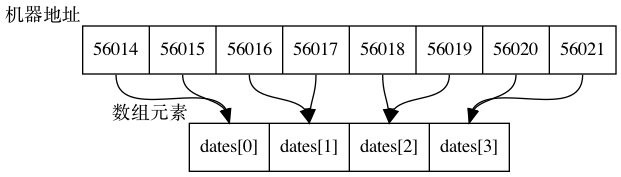

## 10.1 数组

### 10.1.1 初始化数组

只储存单个值的变量有时也称为标量变量 (scalar variable), 我们已经很熟悉如何初始化这种变量:

```c
int fix = 1;
float flax = PI * 2;
```

C 使用新的语法来初始化数组, 如下所示:

```c
int main(void) {
  // 不支持 ANSI 的编辑器会把这种形式的初始化识别为语法错误
  int powers[8] = {1,2,3,45}
}
```

**使用 `const` 声明数组**

有时需要把数组设置为只读, 这样数组只能被读取, 不能被更改.

```c
const int days[MONTHS] = {31, 28, ...}
```

如果使用数组前没有初始化, 那么读取的内存位置上现有的值.

如果使用的数组与声明的存储大小不一致: [程序清单10.3](./10/somedata.c)

* 如果实际长度小于声明长度, 其余为 0
* 如果实际长度大于声明长度, 那么编译失败.

可以让省略数组的长度, 类似于 Golang 的 slice. [程序清单 10.4 day_mon2.c](./10/day_mon2.c)

### 10.1.2 指定初始化器(C99)

传统 C 语言解释器需要初始化最后一个元素之前的所有元素, 才能初始化它:

```c
int arr[6] = {0,0,0,0,0,212}; // 传统写法
```

C99 规定, 可以在初始化列表中使用带方括号的下标指明待初始化的元素:

```c
int arr[6] = {[5] = 212}; // 把 arr[5] 初始化为 212
```

初始化器的两个特征:

+ 如果指定初始化器后面有更多的值, 那么后面这些值将被用于初始化指定元素后面的值.
+ 如果再次初始化指定的元素, 那么最后的初始化将会取代之前的初始化.

### 10.1.3 给数组元素赋值

声明数组后, 可以借助数组下标给数组元素赋值. 例子:

```c
#include <stdio.h>
#define SIZE 50

int main(void) {
  int counter, evens[SIZE];
  
  for (counter = 0; counter < SIZE; counter++) {
    evens[counter] = 2 * counter;
  }
}
```

### 10.1.4 数组边界

在 C 语言中数组越界可以通过编译, 可以运行并且不崩溃, 但是运行的结果会非常奇怪.

[程序清单 10.6 bounds.c](./10/bounds.c)

### 10.1.5 指定数组的大小

```c
float a7[(int)2.5]; // 可以, 已被强制转为整型常量
float a8[n]; // C99 前不允许
float a9[m]; // C99 之前不允许
```

## 10.2 多维数组

多维数组就是嵌套数组.

例子: [程序清单 10.7 rain.c](./10/rain.c)

### 10.2.1 初始化二维数组

pass

### 10.2.2 其他多维数组

声明方法类似于二维数组.

## 10.3 指针和数组

[程序清单 10.8 pnt_add.c](./10/pnt_add.c)

我们的系统中, 地址按字节编址, short 类型占用 2 字节, double 类型占用 8 字节. 

在 C 中, 指针加 1 指的是增加一个存储单元. 对数组而言, 这意味着把加 1 后的地址是下一个元素的地址, 而不是下一个字节的地址. ( 见图 10.3 )



因为 pti 的类型是 short, 所以指针 1, 其值每次递增 2 字节.

现在可以更清楚地定义指向 int 的指针, 指向 float 的指针, 以及指向其他数据对象的指针.

指针的值是它所指向对象的地址. 地址的表示方式依赖于计算机内部的硬件. 许多计算机都是按字节编址, 意思是内存中的每个字节都按顺序编号. 这里, 一个较大对象的地址( 如 double 类型的变量 ) 通常是该对象第一个字节的地址.

在指针前面使用 `*` 运算符可以得到该指针所指向对象的值.

指针加 1 , 指针的值递增它所指向类型的大小( 以字节为单位 ), 举例:

```c
dates + 2 == &date[2] // 相同的地址
*(dates + 2) == dates[2] // 相同的值
```

以上关系表明了数组和指针的关系十分密切, 可以使用指针标识数组的元素和获得元素的值. 从本质上看, 同一个对象有两种表示法. 实际上, C 语言标准在描述数组表示法时确实借助了指针. 

也就是说, 定义 `ar[n]` 的意思是 `*(ar + n)` , 可以认为 `*(ar + n)` 的意思是 "到内存的 ar 位置, 然后移动 n 个单元, 检索存储在那里的值". 

顺便一提, 不要混淆 `*(date+2)` 和 `*dates+2` . 间接运算符 `(*)` 的优先级高于 `+`, 所以 `*dates+2` 相当于 `(*dates)+2`:

```c
*(dates + 2) // dates 第 3 个元素的值
*dates + 2 // dates 第 1 个元素的值加 2
```

[程序清单 10.9 day_mon3.c](./10/day_mon3.c)

在这个程序中, days 是数组首元素的地址,  `days + index` 是元素 `days[index]` 的地址, 而 `*(days+index)` 则是该元素的值, 相当于 `days[index]`. for 循环依次引用数组中的每个元素, 并打印各元素的内容.

这样编写程序是否有优势? 不一定. 编译器编译这两种写法生成的代码相同.

## 10.4 函数, 数组和指针

假设要编写一个处理数组的函数, 该函数返回数组中所有数组中所有元素之和, 待处理的是名为 marbles 的 int 类型数组. 应该如何调用该函数? 

```c
total = sum(marbles); // 可能的函数调用
```

那么, 该函数的原型是什么? 记住, 数组名是该数组首元素的地址, 所有实际参数 marbles 是一个存储 int 类型值的地址, 应把它赋给一个指针形式参数, 即该形参是一个指向 int 的指针:

```c
int sum(int*ar); // 对应的函数原型
```

`sum` 获得了该数组首元素的地址, 知道要在该位置上找出一个整数. 注意, 该函数并未包含数组元素个数的信息. 我们有两种办法让函数获得这一信息. 

方法1, 在函数代码中写上固定的数组大小:

```c
int sum(int*ar) // 相应的函数定义
{
  int i;
  int total = 0;
  for (i = 0; i < 10; i++) { // 假设数组有 10 个元素
    total += ar[i]; // ar[i] 与 *(ar+i) 相同
  }
  return total;
}
```

既然能使用指针表示数组名, 也可以用数组名表示指针. 另外, 回忆一下, `+=` 运算符把右侧运算符对象加到左侧运算对象上. 因此, total 是当前数组元素之和.

如果这样写, 函数只能计算 10 个 int 类型的元素. 另一个比较灵活的方法是把数组大小作为参数 2:

```c
// 这里, 第一个形参告诉函数该数组的地址和数据类型, 第 2 个形参告诉函数该数组中元素的个数.
int sum(int*ar, int n) {
  int i;
  int total = 0;
  
  for (i = 0; i < n; i++) { // 使用 n 个元素
    total += ar[i]; // ar[i] 和 *(ar+i) 相同
  }
  
  return total;
}
```

关于函数的形参, 只有在函数原型或函数定义中, 才可以用 `int ar[]` 代替 `int*ar`:

```c
int sum(int ar[], int n);
```

`int*ar` 形式和 `int ar[]` 形式都表示 ar 是一个指向 int 的指针. 但是, `int ar[]` 只能用于声明形式参数. 第 2 中形式 `(int ar[])` 提醒读者指针 ar 指向的不仅仅一个 int 类型值, 还是一个 int 类型数组的元素.

注意 声明数组形参

因为数组名是该数组首元素的地址, 作为实际参数的数组名要求形式参数是一个与之匹配的指针. 只有在这种情况下, C 才会把 `int ar[]` 和 `int*ar` 解释成一样. 也就是说, ar 是指向 int 的指针. 由于函数原型可以省略参数名, 所以以下 4 种写法是等价的:

```c
int sum(int*ar, int n);
int sum(int*, int);
int sum(int ar[], int n);
int sum(int [], int);
```

[程序清单 10.10](./10/sum_arr1.c) 使用 sum() 函数, 该程序打印原始数组的大小和表示该数组的函数形参的大小.

该程序的输出:

```c
The size of ar is 8 bytes.
The total number of marbles is 190.
The size of marbles is 40 bytes.
```

注意, marbles 的大小是 40 字节. 这没问题, 因为 marbles 内含有 10 个 int 类型的值, 每个值占 4 字节, 所以整个 marbles 的大小是 40 字节. 但是 ar 才 8 字节. 这是因为 ar 并不是数组本身, 它是一个指向 marbles 数组首元素的指针. 我们系统中用 8 字节存储地址, 所以指针变量的大小是 8 字节. 简而言之, 程序清单10.10 中, marbles 是一个数组, ar 是一个指向 marbles 数组首元素的指针, 利用 C 中数组和指针的特殊关系, 可以用数组表示法来表示指针 ar.

### 10.4.1 使用指针形参

函数要处理数组必须知道数组何时开始, 何时结束. 上面的函数 sum 使用一个指针表示数组的开始, 用一个整数形参表示待处理数组的元素个数. 除此之外, 还有一种方法是传递两个指针, 第 1 个指针指明数组的开始处, 第 2 个指针指明数组的结束处. 例子: [程序清单 10.11](./10/sum_arr2.c)

程序清单 10.11 还可以把循环体压缩成一行代码: 

```
total += *start++;
```

一元运算符 `*` 和 `++` 的优先级相同, 但是结合律是从右往左, 所以 `start++` 先求值, 然后才是 `*start` . 也就是说, 指针 start 先递增后指向. 使用后缀形式 (即 start++ 而不是 ++start) 意味着先把指针指向位置上的值加到 total 上, 然后再递增指针. 如果使用 `(*start)++` , 则先使用 start 指向的值, 再递增该值, 而不是递增指针. 这样, 指针将一直指向同一个位置, 但是该位置上的值发生了变化. 

虽然 `*start++` 的写法比较常用, 但是 `*(start++)` 这样写更清楚. [程序清单 10.12](./10/order.c)

### 10.4.2 指针表示法和数组表示法

指针表示法和数组表示法等价, 性能上不会有差别, 在写代码时推荐使用数组表示法.

## 10.5 指针操作

指针变量的 8 种基本操作. [程序清单 10.13 ptr_ops.c](./10/ptr_ops.c)

下面分别描述了指针变量的基本操作.

赋值: 可以把地址赋给指针. 例如, 用数组名, 带地址运算符 `(&)` 的变量名, 另一个指针进行赋值. 在该例中, 把 urn 数组的首地址赋给了 ptr1, 该地址的编号恰好是 xxxx. 变量 ptr2 


