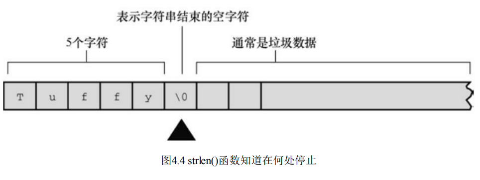

## 4.1 前导程序

[程序清单4.1 talkback.c](./4/talkback.c)

该程序包含以下新特性:

用数组 (array) 存储字符串 (character string). 在该程序中, 用户输入的名被存储在数组中, 该数组占用内存中 40 个连续的字节, 每个字节存储一个字符值.

使用 `%s` 转换说明来处理字符串的输入和输出. 注意, 在 `scanf()` 中, name 没有 `&` 前缀, 而 weight 有.

用 C 预处理器把字符串常量 DENSITY 定义 62.4.

用 C 函数 `strlen()` 获取字符串的长度.

## 4.2 字符串简介

### 4.2.1 char 类型数组和 null 字符

C 语言没有专门用于存储字符串的变量类型, 字符串都被存储在 char 类型的数组中.

数组由连续的存储单元组成, 字符串中的字符被存储在相邻的存储单位中, 每个单位存储一个字符.

```c
// 数组中的字符串存储示例: 每个存储单元1字节, 结尾\0 表示空字符
Zing went the strings of my heart!\0
```

**空字符 null character**

`\0` 表示数组末尾位置的字符. 这是空字符(null character), C 语言用它来标记字符串的结束. 

空字符不是数字 0, 它是非打印字符, 其 ASCII 码值是 0.

C 中的字符串一定要以空字符结束, 这意味着数组的容量必须至少比待存储字符串中的字符串多1.

因此有 40 个存储单位的字符串, 只能存储 39 个字符, 剩下一个字节留给空字符.

**什么是数组?**

可以把数组看作是一行连续的多个存储单元, 用更正式的说法是, 数组是同类型数据元素的有序序列.

```c
// name 后面的方括号表示这是一个数组, 方括号中的 40 表示该数组中的元素数量.
// char 表示每个元素的类型.
char name[40];
```

必须先创建一个数组, 把字符串中的字符逐个放入数组, 还要再末尾加一个 `\0`

#### 4.2.2 使用字符串

[程序清单4.2 praise1.c](./4/praise1.c)

**scanf**

`scanf` 在遇到第一个空白(空格, 制表符或换行符) 时就不再读取输入.

**字符串和字符**

字符串常量 `"x"` 和字符常量 `'x'` 不同.

区别之一在于 `'x'` 是基本类型 (char), 而 `"x"` 是派生类型(char 数组);

区别2: `"x"` 实际上由两个字符组成: `'x'` 和空字符 `\0`

#### 4.2.3 strlen 函数

sizeof 运算符, 以字节为单位给出对象的大小.

`strlen` 函数给出字符串中的字符长度.

又因为 1 字节存储一个字符, 但是 `sizeof` 和 `strlen` 应用于字符串数组求出的大小可能不同. sizeof 是看字节数会把 `\0` 也算进去, sizeof 只单纯看字符串的大小.

[程序清单 4.3 praise2.c](./4/praise2.c)

一般而言, C 把函数库中相关的函数归为一类, 并为每类函数提供一个头文件. 例如, `printf()` 和 `scanf()` 都隶属标准输入和输出函数, 使用 `stdio.h` (standard io, 标准 io) 头文件. `string.h` 头文件中包含了 `strlen` 函数和其他一些与字符串相关的函数(如拷贝字符串的函数和字符串查找函数)



name 数组有 40 个存储单元, 只有前 11 个单元用来存储 Serendipity 这个 word, 所以 `strlen()` 得出的结果是 11. name 数组的第 12 个单元存储空字符, `strlen` 并未将其记入. Name 数组13 个单位起存储的东西都是为了填空空位的垃圾数据.

总之, `strlen` 不像 `sizeof` 一样是查看开辟的内存大小, 而是看实际的有效的字符大小.

第 3 章提到过, C99 和 C11 标准专门为 sizeof 运算符的返回类型添加了 `%zd` 转换说明, 这对于 `strlen()` 同样适用. 这对于 `strlen()` 同样适用.

`sizeof` 是否需要使用圆括号?

圆括号的使用时机取决于运算对象是类型还是特定量? 

运算对象是类型时, 圆括号必不可少. 对于特定量, 圆括号可有可无. 对于类型, 应写为 `sizeof(char)`; 对于特定量, 可写成 `sizeof name` 或 `sizeof 6.28`

### 4.3 常量和 C 预处理器

**符号常量 symbolic constant**

为什么使用符号常量更好?

+ 易读性
+ 便于维护

**C 预处理器**

```c
#define TAXRATE 0.015
```

C 预处理器的作用是, 编译程序时, 程序中所有的 TAXRATE 都会被替换成 0.015. 这一过程被称为编译时替换( compile-time substitution). 这样定义的常量也被称为明示常量. (manifest constant)

语法模板:

```c
// NAME 大写是传统
#define NAME value
```

预处理器的工作示例:

1. 代码文件

   ```c
   #define TAXRATE 0.015
   
   int main(void){
     bill = TAXRATE * sum;
   }
   ```

2. 预处理器

   ```c
   int main(void){
     bill = 0.015 * sum;
   }
   ```

3. 编译器

[程序清单 4.4 pizza.c](./4/pizza.c)

`#define` 指令还可以定义字符和字符串常量. 前者使用单引号, 后者使用双引号.

```c
#define BEEP `\a`
#define TEE 'T'
#define ESC '\033'
#define OOPS "Now you have done it!"
```

#### 4.3.1 const 限定符

C90 新增了 const 关键字, 用于限定一个变量为只读. 其声明如下:

```c
const int MONTHS = 12; // MONTHS 在程序中不可更改, 值为 12
```

#### 4.3.2 明示常量

明示常量, 是指在 `limits.h` 头文件中给出了各类型数值的极值(最大值和最小值)

如:

```c
// 最大值
#define INT_MAX +32767
// 最小值
#define INT_MIN -32768
```

[程序清单 4.5 defines.c](./4/defines.c)

### 4.4 printf() 和 scanf()

#### 4.4.1 printf 函数

**转换说明**

+ `%a`/`%A`, 浮点数, 十六进制数和 p 计数法
+ `%c`, 单个字符
+ `%d`, 有符号十进制整数
+ `%e`/`%E`, 浮点数, e 计数法
+ `%f`, 浮点数十进制
+ `%p`, 指针
+ `%s`, 字符串
+ `%u`, 无符号十进制整数
+ `%x`, 无符号十六进制
+ `%X`, 无符十六进制整数
+ `%%`, 打印 百分号.

#### 4.4.2 使用 printf

[程序清单 4.6 printout.c](./4/printout.c)

#### 4.4.3 printf() 的转换说明修饰符

sizeof 运算符以字节为单位返回类型或值的大小. 这应该是是某种形式的整数, 但是标准只规定了该值是无符号整数. 在不同的实现中, 如果要用 `printf` 函数显示 `sizeof` 表达式, 根据不同系统, 可能使用 `%u`, `%lu`. 首先, `stddef.h` 头文件把 `size_t` 定义成系统使用 `sizeof` 返回的类型, 这被称为底层类型 (underlying type). 

[程序清单 4.7 width.c](./4/width.c)

[程序清单 4.8 floats.c][./4/floats.c]

[程序清单 4.9 flags.c](./4/flags.c)

#### 4.4.5 使用 scanf()

`scanf` 和 `printf` 类似, 使用格式字符串和参数列表. `scanf` 中的格式字符串表明了字符输入流的目标数据类型.

`printf` 函数使用变量, 常量和表达式, scanf 函数指向使用变量的指针.

 `scanf` 有两条简单的规则:

+  如果使用 `scanf` 读取基本变量类型的值, 需要在变量名前面加一个 `&`;
+ 如果用 `scanf` 把字符串读入字符数组中, 不要使用 `&`

[程序清单 4.15 input.c](./4/input.c)

`scanf` 和 `printf` 几乎完全相同, `scanf` 也可以使用多个表达式, 一口气读取多个值.

**1. 从 scanf() 角度看输入**

 `scanf()` 函数每次读取一个字符, 跳过所有的空白字符, 直到遇见第一个非空白的字符才开始读取. 因为要读取整数, 所有 `scanf()` 希望发现一个数字字符或一个符号. 如果找到一个数字或符号, 它便保存该字符串, 并读取下一个字符.如果遇到一个非数字字符, 它便认为程序走到了结尾, 然后 scanf 把非数字字符放回输入. 这意味着程序在下一次读取输入时, 首先读到的是上一次读取丢失的非数字字符.

**2. 格式字符串中的普通字符**

```c
scanf("%d,%d",&n, &m)
```

表示用户将输入一个数字,一个逗号,一个数字. 又因为scanf 会跳过数字前面的空白字符, 所以以下输入都是合法的:

```c
88,121
88,
121
88, 121
```


 